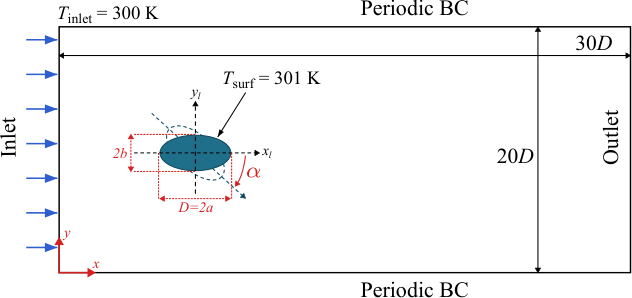

# NumPy Surrogate Models

This repo contains surrogate models presented in our publication **Data-Driven Local Nusselt Number Modeling Around Elliptic Cylinders for Surface-Resolved DEM-CFD Heat Transfer**. They are used to predict the local Nusselt number at the surface of isolated cylinders with elliptical cross-sections.

It provides:
- A Gaussian Process surrogate with mean and uncertainty predictions
- Two symbolic-regression surrogates, one at complexity 18 and one at complexity 30
- A small example `main.py` showing how to call the surrogates

No runtime dependency other than NumPy is required for inference.

## Physical inputs

The surrogate interfaces take these variables directly:
- `Re`: inlet Reynolds number
- `angle_of_attack_deg`: angle of attack in degrees
- `AR`: aspect ratio, defined as semi-major axis length divided by semi-minor axis length (a/b)

The returned curves are ordered over the full azimuthal angle $\theta$ from `0` to `359` degrees, where $\theta = 0$ corresponds to the stagnation point, i.e., the point where the fluid first hits the cylinder (the smallest local coordinate). 



## Recommended validity ranges

The Gaussian Process surrogate is intended for:
- `Re` in `[10, 200]`
- `angle_of_attack_deg` in `[0, 90]`
- `AR` in `[1.2, 5]`

The symbolic-regression surrogates use the same physical ranges. In addition, they are less reliable when:
- `AR > 2`
- `angle_of_attack_deg > 40`

## Installation

Install NumPy in the environment you want to use:

```bash
pip install numpy
```

## Quick start

From this folder:

```bash
python main.py
```

Or import directly:

```python
from utils import (
	get_gp_training_inputs_raw,
	predict_gp_curve,
	predict_sr_theta_curve,
	predict_sr_theta_value,
)

Re = 200.0
angle_of_attack_deg = 30.0
AR = 2.0

# GP: full distribution over theta=0..359
nu_gp = predict_gp_curve(Re, angle_of_attack_deg, AR)
nu_gp_mean, nu_gp_std = predict_gp_curve(Re, angle_of_attack_deg, AR, return_std=True)

# SR: full distribution over theta=0..359
nu_sr18 = predict_sr_theta_curve(Re, angle_of_attack_deg, AR, complexity=18)
nu_sr30 = predict_sr_theta_curve(Re, angle_of_attack_deg, AR, complexity=30)

# SR: value at a specific theta (degrees)
nu_sr30_theta45 = predict_sr_theta_value(
	Re,
	angle_of_attack_deg,
	AR,
	theta_deg=45.0,
	complexity=30,
)
```

## GP interface details

`predict_gp_curve(Re, angle_of_attack_deg, AR, return_std=False)`
- Inputs are the physical variables directly; no manual scaling is needed
- Returns the 360-point local Nusselt distribution over `theta`
- If `return_std=True`, also returns the predictive standard deviation at each `theta`

## SR interface details

`predict_sr_theta_curve(Re, angle_of_attack_deg, AR, theta_deg=None, complexity=18 or 30)`
- Returns the full `theta` distribution when `theta_deg=None`
- Uses the complexity-18 or complexity-30 closed-form expression

`predict_sr_theta_value(Re, angle_of_attack_deg, AR, theta_deg, complexity=18 or 30)`
- Returns a single scalar prediction at one specified `theta`
